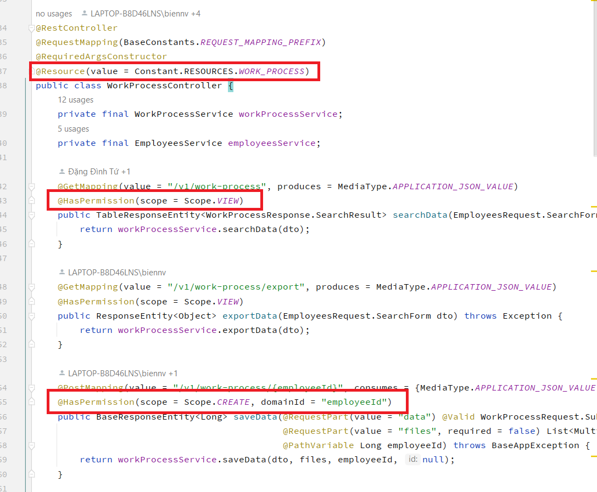

#1. Bước 1:
- Thực hiện khai báo cáo chức năng trong danh mục mã chức năng, 
- Đồng thời khai báo mã chức năng vào file Constants.java, interface RESOURCES

#2. Bước 2:Thực hiện khai báo check phân quyền tại file controller của API, 

    Khai báo annotation @Resource(value = Constant.RESOURCES.EMPLOYEE) trên định nghĩa class, với Constant.RESOURCES.EMPLOYEE là mã chức năng tương ứng.

    Tại các api cần check phân quyền, thực hiện thêm annotion :  @HasPermission trên method tương ứng với các tham số:

        - scope : mã scope cần check
        - resource : mã chức năng cần check, (chỉ cần khai báo khi mã chức năng khác với mã chức năng được khai báo ở class)
        - domainId : Trong trường hợp cần phân quyền theo miền dữ liệu, Khai báo tên biến cần check phân quyền miền dữ liệu 
        - domainType : Khai báo loại miền dữ liệu cần check (mặc định EMPLOYEE).

Lưu ý: Không khai báo @HasPermission đối với các api không cần check phân quyền

