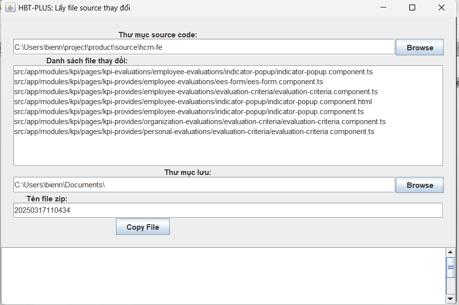

# 1. Lấy danh sách file thay đổi 
Thực hiện lấy danh sách file thay đổi từ git bằng cách run câu lệnh 

        git diff --name-only <commit hash>^ HEAD
        vd: git diff --name-only a1b2c3d4^ HEAD
# 2. Run file để lấy danh sách file thay đổi
Thực hiện click double file assets/HBT-Get-FileChange.jar

    **Trong đó:**
    - Thư mục source code : Chọn thư mục source lưu code
    - Danh sách file thay đổi: Danh sách file cần lấy, dựa vào bước 1.
    - Thư mục lưu file: Là thư mục lưu trữ file được copy
    - Tên file zip: Tên file zip được tạo.